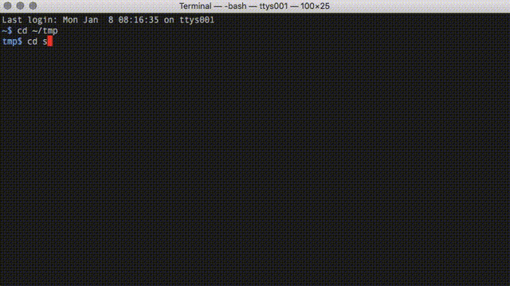

[](https://github.com/callmekohei/tigaDebugger/blob/master/LICENSE)

[](https://gitter.im/vim-jp/reading-vimrc)

# tigaDebugger

debugger clinet framework for Vim8

<br>
<br>

## ScreenShot

  

## Requirements

has('python3')

```
01. roxma/nvim-yarp
02. roxma/vim-hug-neovim-rpc
03. g:python3_host_prog pointed to your python3 executable, or echo exepath('python3') is not empty.
04. neovim python client (pip3 install neovim)
```

## Installing

fsdebugger requires mono/sdb installed.

```
$ git clone --depth 1 https://github.com/callmekohei/fsdebugger
$ git clone --depth 1 https://github.com/roxma/nvim-yarp
$ git clone --depth 1 https://github.com/roxma/vim-hug-neovim-rpc

$ vim init.vim

set runtimepath+=/path/to/fsdebugger
set runtimepath+=/path/to/nvim-yarp
set runtimepath+=/path/to/vim-hug-neovim-rpc
```


## Usage
```
// open file
$ vim foo.fsx

// set debugger
: TigaSetDebugger sdb

// start debug mode
: Tiga foo.exe

// debugger command
: TigaCommand bp add at foo.fsx 3

// quit sdb
: TigaQuit
```

## About Compile ( For F# user )

Add `--optimize-` parameter

```
// create exe file
$ fsharpc -g --optimize- foo.fs

// create dll file
$ fsharpc -a -g --optimize- foo.fs
```

## Debugger Shortcut Keys

| Press         | To            |
| :------------ | :-------------|
| ctrl b        | Add or delete <b>B</span></b>reakpoint |
| ctrl d        | <b>D</b>elete all breakpoints |
| ctrl r        | <b>R</b>un |
| ctrl k        | <b>K</b>ill (Break) |
| ctrl p        | Re<b>p</b>lace watch variable |
| ctrl y        | Add watch variable |
| ctrl t        | Delete watch variable |
| ctrl n        | Step over ( <b>N</b>ext ) |
| ctrl i        | Step <b>i</b>n | 
| ctrl u        | Step out ( <b>U</b>p ) | 
| ctrl c        | <b>C</b>ontinue |


## Debugger Client Source


If you wirte `debugger client source`, you use your favarite debugger.

I am glad of you to write `debugger client source`.

What is debugger client source?

like this
```
tigaDebugger$ tree
.
├── LICENSE
├── README.md
├── pic
│   └── 20170108.gif
├── plugin
│   └── tigaDebugger.vim
├── pythonx
│   └── tigaDebugger_wrap.py
├── rplugin
│   └── python3
│       └── tigaDebugger
│           ├── __init__.py
│           ├── quickbuffer.py
│           ├── source
│           │   └── sdb.py <--- this !!
│           └── util.py
└── syntax
    └── tigaDebugger.vim
```

