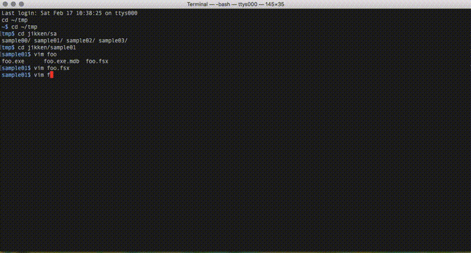

[](https://github.com/callmekohei/tigaDebugger/blob/master/LICENSE)

[](https://gitter.im/vim-jp/reading-vimrc)

# tigaDebugger

Tiny debugger clinet for FSharp on Vim8

<br>
<br>

## ScreenShot



## Requirements
vim8 ( with python3, with terminal )

[mono/sdb](https://github.com/mono/sdb)

[sdbplg](https://github.com/callmekohei/sdbplg)

## Installing

```
// download vim plugins
$ git clone --depth 1 https://github.com/callmekohei/tigaDebugger
$ git clone --depth 1 https://github.com/roxma/nvim-yarp
$ git clone --depth 1 https://github.com/roxma/vim-hug-neovim-rpc

// install neovim plugins
$ pip3 install neovim

// set runtimepath
$ vim .vimrc

    set runtimepath+=/path/to/tigaDebugger
    set runtimepath+=/path/to/nvim-yarp
    set runtimepath+=/path/to/vim-hug-neovim-rpc
```

## Usage

```
// compiel file
$ fsharpc -g --optimize- foo.fsx

// open file
$ vim foo.fsx

// start debug mode
: Tiga foo.exe

// debugger command
: TigaCommand bp add at foo.fsx 3

// quit debug mode
: TigaQuit
```

## Debugger Shortcut Keys

| Press         | To            |
| :------------ | :-------------|
| ctrl b        | Add or delete <b>B</span></b>reakpoint |
| ctrl d        | <b>D</b>elete all breakpoints |
| ctrl r        | <b>R</b>un |
| ctrl k        | <b>K</b>ill (Break) |
| ctrl p        | Re<b>p</b>lace watch variable |
| ctrl y        | Add watch variable |
| ctrl t        | Delete watch variable |
| ctrl n        | Step over ( <b>N</b>ext ) |
| ctrl i        | Step <b>i</b>n | 
| ctrl u        | Step out ( <b>U</b>p ) | 
| ctrl c        | <b>C</b>ontinue |


## About Compile

Add `--optimize-` parameter

```
// create exe file
$ fsharpc -g --optimize- foo.fsx

// create dll file
$ fsharpc -a -g --optimize- foo.fsx
```

## About Vim's Terminal
```
// vim mode ( enable to scroll )
ctrl w
shift n

// terminal mode
i
```

## About Top-Level variables

Please add manually


(sample code)
```fsharp
// file name is foo.fsx

module Bar =
    let mutable x = "hello"
    x <- "world"
    stdout.WriteLine(x)
```

( tiga command )
```
: TigaWatchAdd Foo.Bar.x
```

(result)
```
─── Expressions ─────────────────
No locals
#0 'Foo.Bar.x':string it = "hello"
```

